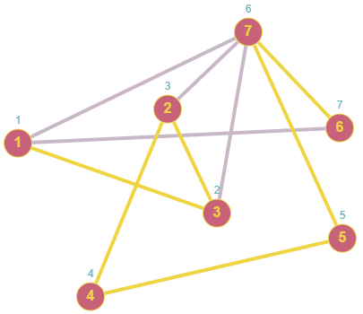

# Задача 1. Обход в глубину
В этом задании нам нужно реализовать обход графа в глубину

Граф представлен матрицей смежности размерностью `N x N` - то есть это двумерный массив, содержащий `N` строчек и `N` столбцов

`N` - это количество вершин графа. Все вершины графа пронумерованы - то есть имеют уникальный индекс от `1` до `N` включительно

Значение находящееся в ячейке матрицы смежности, говорит о наличии или отсутствии связи между вершинами, индексы которых соответствуют номеру строчки и номеру столбца этой ячейки. Если значение в ячейке равно `1`, то связь между вершинами есть. Если значение равно `0`, то связи между вершинами нет. В ячейках с одинаковыми номерами столбца и строки всегда находится `0`

Наша задача: имея предоставленную матрицу смежности, произвести обход графа, представленного этой матрицей, в глубину. При посещении каждой следующей ячейки ваша программа должна вывести на консоль индекс посещаемой ячейки

Матрица смежности будет задаваться в текстовом файле в следующем формате: первым числом в файле идёт количество вершин графа (`N`). Далее располагаются `N` строчек, каждая из которых содержит `N` чисел - `1` или `0`

Обход графа начинается с первой вершины (с индексом `1`)

### Пример работы программы
#### Входящий файл `input.txt`:
```
7
0 0 1 0 0 1 1
0 0 1 1 0 0 1
1 1 0 0 0 0 1
0 1 0 0 1 0 0 
0 0 0 1 0 0 1 
1 0 0 0 0 0 1 
1 1 1 0 1 1 0
```
Визуализация графа: 
#### Вывод на консоль:
```
Порядок обхода вершин: 1 3 2 4 5 7 6
```
Визуализация обхода графа: 
#### Подсказки

> Не читайте этот раздел сразу, попытайтесь сначала решить задачу самостоятельно :)

<details>

<summary>Подсказка. Что использовать для решения?</summary>

Для чтения из файла используйте `std::ifstream`

Для хранения матрицы смежности используйте двумерный динамический массив

Вам понадобится одномерный динамический массив для хранения информации об уже посещённых вершинах

Алгоритм обхода графа в глубину описан в лекции

</details>