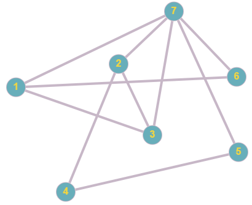
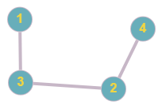

# Задача 3. Поиск циклов
В этом задании вам нужно реализовать поиск циклов в графе.

Граф представлен матрицей смежности размерностью `N x N` — это двумерный массив, содержащий `N` строчек и `N` столбцов.

`N` — это количество вершин графа. Все вершины графа пронумерованы, то есть имеют уникальный индекс от `1` до `N` включительно.

Значение, находящееся в ячейке матрицы смежности, говорит о наличии или отсутствии связи между вершинами, индексы которых соответствуют номеру строчки и номеру столбца этой ячейки. Если значение в ячейке равно `1`, то связь между вершинами есть. Если значение равно `0`, то связи между вершинами нет. В ячейках с одинаковыми номерами столбца и строки всегда находится `0`.

Ваша задача — имея предоставленную матрицу смежности, дать ответ, имеется ли в графе цикл.

Матрица смежности будет задаваться в текстовом файле в формате: первым числом в файле идёт количество вершин графа (`N`). Далее располагаются `N` строчек, каждая из которых содержит `N` чисел — `1` или `0`.

### Примеры работы программы
#### Пример 1
##### Входящий файл `input.txt`:
```
7
0 0 1 0 0 1 1
0 0 1 1 0 0 1
1 1 0 0 0 0 1
0 1 0 0 1 0 0 
0 0 0 1 0 0 1 
1 0 0 0 0 0 1 
1 1 1 0 1 1 0
```

Визуализация графа: 
##### Консоль:
```
В графе есть цикл!
```
#### Пример 2
##### Входящий файл `input.txt`:
```
4
0 0 1 0
0 0 0 1
0 1 0 0
0 0 0 0
```

Визуализация графа: 
##### Консоль:
```
В графе нет циклов
```
#### Подсказки

> Не читайте этот раздел сразу. Попытайтесь сначала решить задачу самостоятельно :)

<details>

<summary>Что использовать для решения.</summary>

Для чтения из файла используйте `std::ifstream`.

Для хранения матрицы смежности используйте двумерный динамический массив.

Вам понадобится одномерный динамический массив для хранения информации об уже посещённых вершинах.

Алгоритм поиска циклов описан в лекции.

</details>
